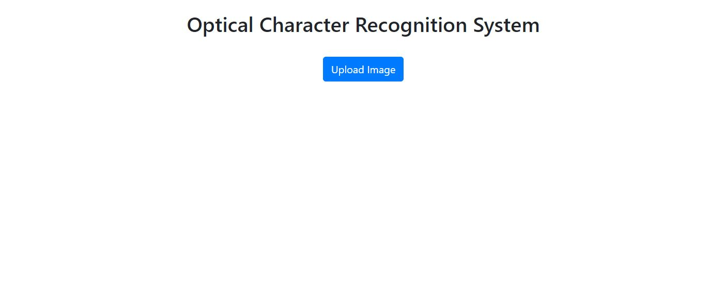
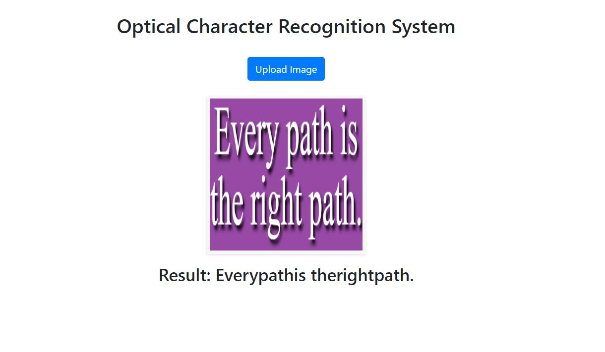

# Optical_Character_Recognition
This repositery has a method to detect characters from the image. It uses opencv to read image and pytesseract to get text in the image.

###Step to follow

clone the repositery

install requirements

run server.py

can view this system at "http://ec2-52-14-210-72.us-east-2.compute.amazonaws.com/"
